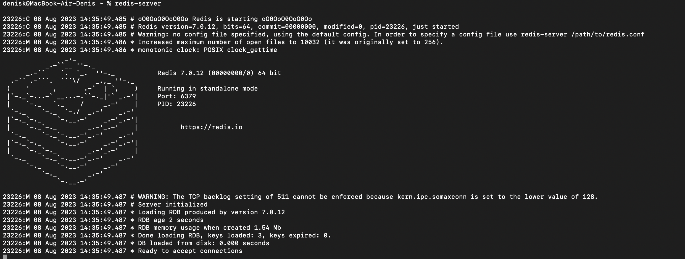

# Test-o-parser - Парсинг данных с Озон

## Стек технологий

[](https://www.python.org/)
[](https://www.djangoproject.com/)
[](https://www.mysql.com/)
[](https://www.w3.org/TR/html52/)
[](https://www.w3.org/Style/CSS/Overview.en.html)
[](https://getbootstrap.com/)
[](https://www.ecma-international.org/publications/standards/Ecma-262.htm)
[](https://celeryproject.org/)
[](https://redis.io/)
[](https://www.selenium.dev/)
[](https://adminlte.io/)
[](https://drf-yasg.readthedocs.io/)


## Описание проекта

Данный проект выполняет парсинг данных с Озон по Post-запросу, основываясь на атрибуте, введённом пользователем. В случае отсутствия атрибута, система автоматически парсит 10 продуктов. После успешного завершения процесса парсинга, телеграм-бот уведомляет пользователя о выполнении задачи. Команда 'Список товаров' активирует бота для отображения продуктов и соответствующих ссылок с последнего сеанса парсинга. Кроме того, возможен просмотр как всего списка продуктов, так и информации о конкретном продукте через Get-запрос. Так же в проекте настроена AdminLTE панель и документация Django drf-yasg.

Процесс парсинга разделен на четыре этапа(модуля): первый этап заключается в извлечении страниц с сайта; второй этап включает в себя извлечение ссылок из этих страниц; на третьем этапе эти ссылки подставляются в API, и система получает JSON-ответ; на четвертом этапе из JSON извлекаются необходимые данные.

## Установка проекта локально

* Склонировать репозиторий на локальную машину:
```bash
git clone https://github.com/DenisKtv/DenisKtv-test-o-parser.git
cd DenisKtv-test-o-parser
```

## Важно:
В проекте, по пути:
DenisKtv-test-o-parser/api_parser/api_parser/product_parser/ 
в файле load_sources можно заменить ozone.by на ozone.ru или ozone.kz в зависимости от вашего региона!


* Cоздать и активировать виртуальное окружение:

```bash
python -m venv venv
```

```bash
. venv/bin/activate
```

* Установить зависимости из файла requirements.txt:

```bash
pip install -r requirements.txt
```

* Cоздайте файл `.env` с содержанием:

```
# Django
DJANGO_KEY = 'some key'

# Database
DB_NAME = 'mydatabase'
DB_USER = 'username'
DB_PASSWORD = 'password'
DB_HOST = 'localhost'
DB_PORT = '3306'

# Telegram
ADMIN_TOKEN = 'some token'
MY_CHAT = 'some id'
```

* Перейдите в приложение и выполните миграции:

```bash
cd api_parser
python manage.py makemigrations
python manage.py migrate
```

* Запустите сервер:
```bash
python manage.py runserver
```

* Запустите Сelery и брокер сообщений Redis:
установка Redis:
Для macOS:
```bash
brew install redis
redis-server
```
Для Linux:
```bash
sudo apt install redis-server
redis-serve
```
Для Windows:

Скачать и установить и запустить по инструкции: https://github.com/microsoftarchive/redis



Откройте новое окно консоли для Celery:
```bash
cd DenisKtv-test-o-parser/api_parser
celery -A api_parser worker --loglevel=info
```


## Для запуска ботa локально:
Перейти в нужный репозиторий и запустить ботов:
```bash
cd bots/
python bot.py
``` 


## Примеры запросов:


